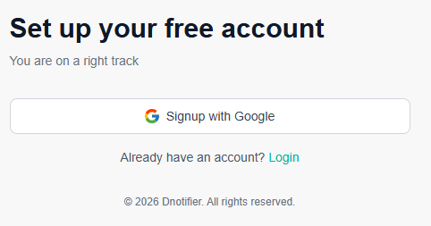
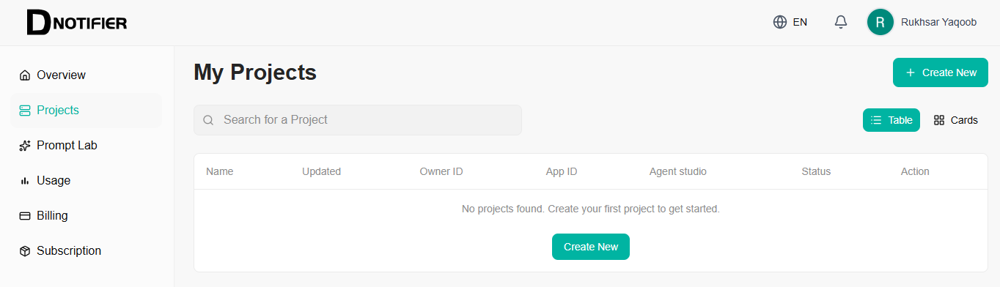
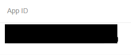
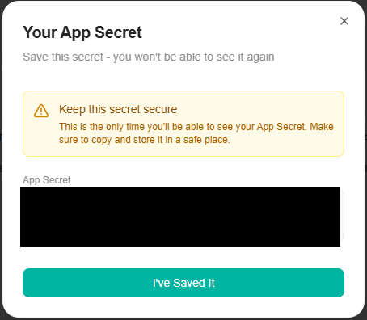

# AI-Agents-in-Node.js
# Getting Started with DNotifier in Node.js

A step-by-step guide to creating a DNotifier project, finding your App ID and App Secret, and connecting to DNotifier from a Node.js backend — so you can build real-time agents, notifications, and AI-powered features.

Follow every step in order and you'll go from "no account" to "connected and receiving messages."

---

## Table of Contents

- [What You'll Do](#what-youll-do)
- [Prerequisites](#prerequisites)
- [Part 1 — Dashboard Setup](#part-1--dashboard-setup)
- [Part 2 — Node.js Project Setup](#part-2--nodejs-project-setup)
- [Part 3 — Connecting from Node.js](#part-3--connecting-from-nodejs)
- [Part 4 — Sending a Test Message (Optional)](#part-4--sending-a-test-message-optional)
- [Part 5 — AI and RAG on the Server](#part-5--ai-and-rag-on-the-server)
- [Common Errors & Fixes](#common-errors--fixes)
- [Summary](#summary)

---

## What You'll Do

- Sign up / log in to the DNotifier Dashboard
- Create a new project
- Find your **App ID** and **App Secret**
- Install the DNotifier SDK in a Node.js project
- Write the connection code and confirm it connects successfully

## Prerequisites

- Node.js installed on your machine
- A Node.js backend project (Express or plain Node) — or a fresh empty folder to start one
- A DNotifier account (free to sign up)

---

## Part 1 — Dashboard Setup

### Step 1: Log In to the DNotifier Dashboard

Go to [app.dnotifier.com](https://app.dnotifier.com) and sign up (Google sign-up shown below), or log in if you already have an account.



### Step 2: Create a New Project

From the dashboard, go to **Projects** in the sidebar. Click **+ Create New** (top right, or the button in the empty state) and give your project a name.



### Step 3: Find Your App ID

Open your project. Your **App ID** is shown on the project's overview page, with a copy icon next to it.


> *(Blurred here — yours will show a real value like `app_xxxxxxxxxxxxxxxx`)*

### Step 4: Copy Your App Secret

> **Note:** The App Secret is **not** the same as an API Key. It's shown automatically in a popup right after you create the project (Step 2) — it is **not** something you generate separately.

This is the only time you'll see it, so copy it immediately and store it safely before closing the popup.


> *(Blurred here — yours will show a real value)*

> ⚠️ **Warning:** Treat this App Secret like a password. Never commit it to GitHub or expose it in frontend/browser code. Store it only in your backend's `.env` file.

---

## Part 2 — Node.js Project Setup

### Step 5: Install the DNotifier SDK

In your Node.js backend project folder, run:

```bash
npm install @dnotifier-realtime/dnotifier
```

> 💡 **Tip:** If `ws` isn't already in your project's dependencies, install it too:
> ```bash
> npm install ws
> ```
> Node.js doesn't have a browser-native WebSocket, so the SDK needs `ws` to fill that gap. (Not needed if you're connecting from a browser — browsers have `WebSocket` built in.)

### Step 6: Add Your Credentials to `.env`

Create (or open) your `.env` file in the backend root and add:

```env
DNOTIFIER_APP_ID=your_app_id_here
DNOTIFIER_SECRET=your_secret_key_here
```

> 💡 **Tip:** Make sure `.env` is listed in your `.gitignore` file so these values are never pushed to a public repository.

---

## Part 3 — Connecting from Node.js

### Step 7: Write the Connection Code

Create a file (e.g. `agent.js`) with the following:

```javascript
import { DNotifier } from "@dnotifier-realtime/dnotifier";
import WebSocket from "ws";

const notifier = new DNotifier({
  appId: process.env.DNOTIFIER_APP_ID,
  secret: process.env.DNOTIFIER_SECRET,
  transport: "ws",
  userId: "my_backend_service",   // any identifier you choose
  WebSocketImpl: WebSocket,       // required in Node.js
  onConnected: () => console.log("Connected ✓"),
  onMessage: (data) => {
    console.log("Received:", data.payload.toJSON());
  },
  onDisconnected: () => console.log("Disconnected"),
});

await notifier.connect();

export { notifier };
```

> 💡 **Tip:** `WebSocketImpl: WebSocket` is the key line for Node.js. Without it, you'll get:
> `Error: No WebSocket implementation provided.`
> This line isn't needed in browser code — browsers have `WebSocket` built in.

### Step 8: Run It and Confirm the Connection

Start your backend as usual:

```bash
npm run dev
# or
node index.js
```

You should see `Connected ✓` printed in your terminal, confirming the SDK successfully authenticated and connected.

---

## Part 4 — Sending a Test Message (Optional)

To confirm two-way communication, send a message to yourself and see it echoed back (or send from a second connected client):

```javascript
await notifier.send({
  senderId: "my_backend_service",
  receiverId: "my_backend_service",
  data: { type: "ping", message: "hello DNotifier" },
});
```

If everything is wired up correctly, your `onMessage` callback will log the payload back to the terminal.

---

## Part 5 — AI and RAG on the Server

For AI-powered features (like answering questions from a knowledge base), keep prompts and document ingestion on trusted backend infrastructure. This uses `transport: "http"` instead of `"ws"`, since it's a direct request/response with DNotifier's own AI service — not agent-to-agent messaging.

> 💡 **Tip:** This requires a **paid DNotifier plan** with AI enabled. On the free plan, `notifier.sendAI()` and `notifier.addDocument()` calls will not work.

```javascript
const notifier = new DNotifier({
  appId: process.env.DNOTIFIER_APP_ID,
  secret: process.env.DNOTIFIER_SECRET,
  transport: "http",
  userId: "svc-ai",
  onConnected: () => {},
  onMessage: () => {},
  onDisconnected: () => {},
});

await notifier.connect();

await notifier.addDocument({
  senderId: "svc-ai",
  recordId: "policy-v2",
  content: "...",
  type: "text",
});

const answer = await notifier.sendAI({
  senderId: userId,
  message: { useKnowledgeBase: true, text: question },
});
```

- **`addDocument()`** — uploads a document (FAQ, policy, article) into the project's knowledge base, identified by `recordId`
- **`sendAI()`** — sends a user's question to DNotifier's AI, optionally grounding the answer in the uploaded knowledge base (`useKnowledgeBase: true`)

This is also the pattern to use for batch processing, cron-driven reports, and webhook-triggered AI — running workflows on the server rather than in the client.

---

## Common Errors & Fixes

| Error | Fix |
|---|---|
| `No WebSocket implementation provided` | You forgot `WebSocketImpl: WebSocket` (Node.js only — not needed in browsers). |
| `invalid project credentials` | Double-check you copied the App ID and Secret from the correct **project**, not the Organization-level ID. |
| `senderId required` | Make sure every `notifier.send()` call includes `senderId`, and either `receiverId` or `receiverIds`. |

---

## Summary

You've now:

- ✅ Created a DNotifier project
- ✅ Located your App ID and App Secret
- ✅ Installed the SDK in a Node.js backend
- ✅ Successfully connected and confirmed two-way messaging

From here, you can build out message handlers, AI agent logic, or real-time features on top of this connection.
